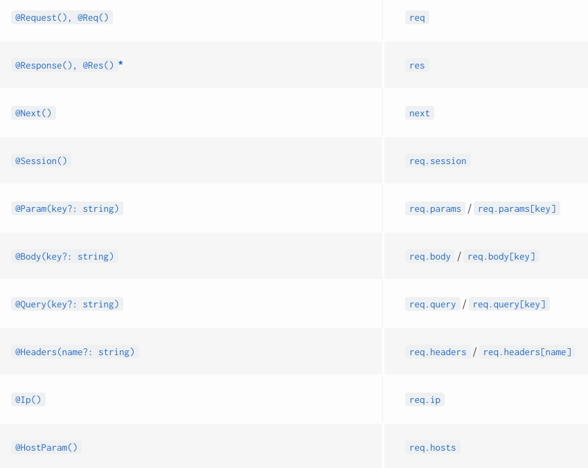
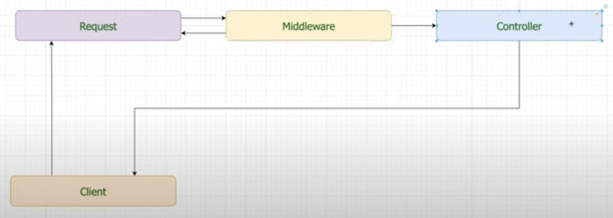
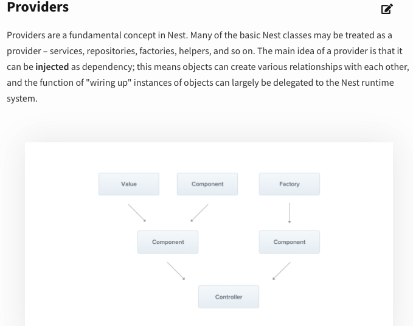
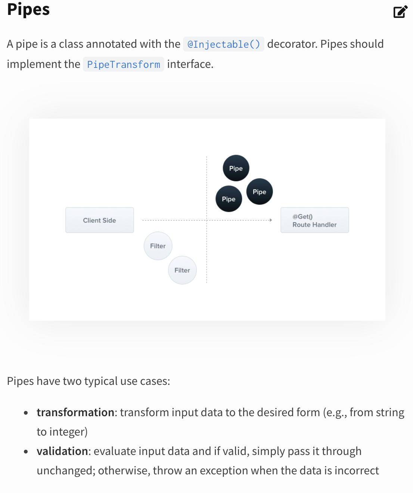
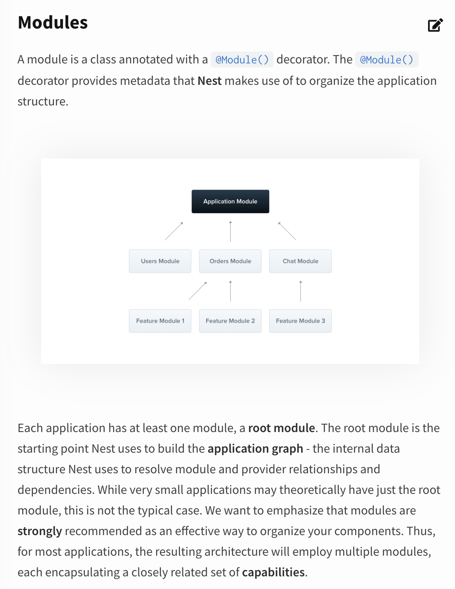

# [NestJS Crash Course - 2021](https://www.youtube.com/watch?v=S0R82Osg-Mk&t=6322s&ab_channel=LaithHarb)

- [NestJS Crash Course - 2021](#nestjs-crash-course---2021)
  - [Intro](#intro)
  - [Creating a Nest App](#creating-a-nest-app)
  - [Controllers](#controllers)
  - [Request Objects](#request-objects)
    - [List of decorators in NestJS](#list-of-decorators-in-nestjs)
  - [Data Transfer Objects (DTO)](#data-transfer-objects-dto)
  - [Providers](#providers)
  - [Pipes](#pipes)
  - [Modules](#modules)
  - [Middleware](#middleware)
    - [Why?](#why)
  - [Additions](#additions)
    - [Database handling](#database-handling)
    - [Swagger documenation](#swagger-documenation)
    - [Authentication](#authentication)
    - [Error handling](#error-handling)
    - [Testing](#testing)
      - [Flagpole](#flagpole)
  - [Extras](#extras)
    - [Deployment](#deployment)
    - [Docker basics](#docker-basics)

## Intro

## Creating a Nest App

explaining the main and app.module.ts do

## Controllers

defining how to generate an endpoint

## Request Objects

Defining how to catch the user inputs

### List of decorators in NestJS

## Data Transfer Objects (DTO)

Create DTOs to validate body input

## Providers

Handling the data generation (commonly by dealing with databases)

## Pipes

use the ParseUUidPipe for all endpoints that take an id as a parameter

## Modules

Create a Module for students and teachers

## Middleware

Adding extra functionality to the app.

### Why?

For when we have many repeated blocks of code.

For example:

- to check that the id belongs to a field int he database
- to check if the user has the credentials to access the database
- handle general errors
- parse JSON tockens

## Additions

### Database handling

### Swagger documenation

### Authentication

### Error handling

### Testing

#### Flagpole

## Extras

### Deployment

### Docker basics
